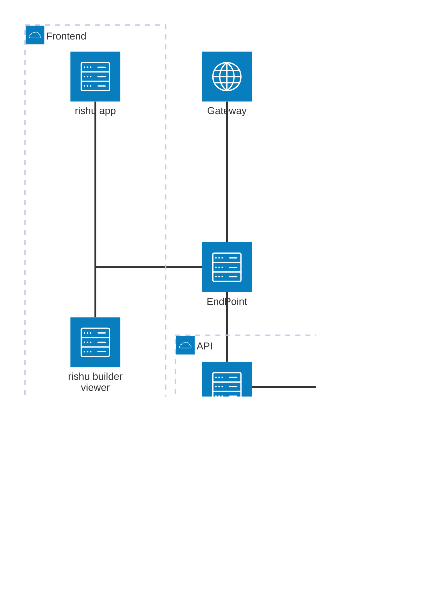

Inspired by [kurisyushien.org](https://kurisyushien.org)

# [rishu-app](https://yamato.kurisyushien.org)


このプロジェクトは、[risyu](https://kurisyushien.org)を参考に作成された、金沢大学の学生向けの履修支援ツールです。履修登録期間における抽選科目の登録状況の可視化と、シラバス情報の検索・閲覧機能を提供します。

## 概要

rishu-appは、金沢大学の学生が履修登録をより効率的に行えるよう支援するWebアプリケーションです。

### 主な機能

- **抽選科目の登録状況可視化**: 履修登録期間中の抽選科目の申込状況をグラフで表示
- **シラバス情報の提供**: 金沢大学のシラバスデータを検索・閲覧可能な形で提供

## rishu-appに関わる人を募集中

このプロジェクトへの参加を歓迎します！

### 貢献の始め方

- 🌱 **初めての方**: [初心者向け貢献ガイド](./CONTRIBUTING_BEGINNERS.md) - GitHubの使い方から丁寧に解説
- 📖 **経験者の方**: [貢献ガイドライン](./CONTRIBUTING.md) - 開発ワークフローやコーディング規約

開発に参加したい方は、Twitterの[@ToYamaSoujin](https://x.com/ToYamaSoujin)または、[toyamasoujinn@gmail.com](toyamasoujinn@gmail.com)までお気軽にご連絡ください。

### 参加方法

- **不具合報告**: [Issues](https://github.com/ToYama170402/rishu-app/issues)で不具合を報告
- **機能提案**: 新機能のアイデアをIssuesで提案
- **改善提案**: コードの改善や新機能の追加
- **文書改善**: READMEやドキュメントの改善

詳しい参加ガイドラインは[CONTRIBUTING.md](CONTRIBUTING.md)をご覧ください。

### 連絡先

質問や相談は以下の方法でお気軽にどうぞ：
- **GitHub Issues**: 技術的な質問や不具合報告
- **X (Twitter)**: [@ToYamaSoujin](https://x.com/ToYamaSoujin)
- **Email**: [toyamasoujinn@gmail.com](mailto:toyamasoujinn@gmail.com)

## 開発環境のセットアップ

このプロジェクトでは、Dev Containerを使用して一貫した開発環境を提供しています。各サービスごとに独立したDev Container環境が用意されています。

### 必要な環境

- [Git](https://git-scm.com/)
- [Visual Studio Code](https://code.visualstudio.com/)
- [Docker](https://www.docker.com/)
- [Dev Containers拡張機能](https://marketplace.visualstudio.com/items?itemName=ms-vscode-remote.remote-containers)

### セットアップ手順

1. **リポジトリのクローン**
   ```bash
   git clone https://github.com/ToYama170402/rishu-app.git
   cd rishu-app
   ```

2. **環境変数の設定**
   
   `sample.env`を参考に`.env`ファイルを作成し、必要な環境変数を設定してください。

3. **Dev Containerで開く**
   
   - VS Codeでクローンしたディレクトリを開く
   - コマンドパレット（`Ctrl+Shift+P` / `Cmd+Shift+P`）を開く
   - `Dev Containers: Reopen in Container`を選択
   - 開発したいサービスを選択（frontend、syllabus-frontend、syllabus-backend、syllabus-scrapeなど）

開発環境では`docker-compose.yml`を`docker-compose.dev.yml`で上書きして使用します。各サービスのDev Containerで開発サーバーを起動して開発を進めてください。

詳細な開発ガイドラインについては、[CONTRIBUTING.md](CONTRIBUTING.md)を参照してください。

## プロジェクト構成

このプロジェクトは以下のサービスで構成されています：

### frontend
抽選科目の登録状況を可視化するフロントエンドサービス
- **技術スタック**: Next.js, React, TypeScript, MUI
- **役割**: risyu APIから取得したデータをグラフ形式で表示

### syllabus-frontend
シラバス情報を表示するフロントエンドサービス
- **技術スタック**: SolidJS, TypeScript, Tailwind CSS
- **役割**: シラバスデータの検索と閲覧インターフェースを提供

### syllabus-backend
シラバスデータを提供するバックエンドAPI
- **技術スタック**: Go, Gin, GORM, PostgreSQL
- **役割**: シラバスデータベースへのアクセスを提供するRESTful API

### syllabus-scrape
シラバス情報を収集するスクレイピングサービス
- **技術スタック**: TypeScript, Puppeteer, Cheerio
- **役割**: 金沢大学のシラバスサイトから定期的にデータを取得してデータベースに保存

### syllabus-db
シラバスデータを格納するデータベース
- **技術スタック**: PostgreSQL
- **役割**: スクレイピングしたシラバス情報の永続化

## 使用技術

### フロントエンド
- [Next.js](https://nextjs.org/) - Reactベースのフロントエンドフレームワーク
- [SolidJS](https://www.solidjs.com/) - 高性能なUIフレームワーク
- [TypeScript](https://www.typescriptlang.org/) - 型安全な開発言語
- [MUI](https://mui.com/) - Reactコンポーネントライブラリ
- [Tailwind CSS](https://tailwindcss.com/) - ユーティリティファーストCSSフレームワーク

### バックエンド
- [Go](https://golang.org/) - 高性能なバックエンド言語
- [Gin](https://gin-gonic.com/) - Goの軽量Webフレームワーク
- [GORM](https://gorm.io/) - GoのORMライブラリ

### データベース
- [PostgreSQL](https://www.postgresql.org/) - リレーショナルデータベース

### インフラ・開発環境
- [Docker](https://www.docker.com/) - コンテナ化プラットフォーム
- [Docker Compose](https://docs.docker.com/compose/) - マルチコンテナアプリケーション管理
- [Dev Container](https://code.visualstudio.com/docs/remote/containers) - 一貫した開発環境の構築
- [Nginx](https://nginx.org/) - リバースプロキシ

### 外部API
- [risyu API](https://github.com/ogawa3427/risyu_son?tab=readme-ov-file) - 抽選科目の登録状況データ取得

## アーキテクチャ

このプロジェクトは複数のサービスで構成されており、各サービスがDockerコンテナとして動作し、Docker Composeで統合管理されています。


```mermaid
architecture-beta
    group api(cloud)[API]
    group frontend(cloud)[Frontend]

    service db(database)[Database] in api
    service backend(server)[Backend] in api
    service scraper(server)[Scraper] in api

    db:L -- R:backend
    backend:B -- T:scraper

    service rishuapp(server)[rishu app] in frontend
    service rishu(server)[rishu builder viewer] in frontend

    junction frontendjunction
    frontendjunction:T -- B:rishuapp
    frontendjunction:B -- T:rishu

    service endpoint(server)[EndPoint]
    service gateway(internet)[Gateway]

    gateway:B -- T:endpoint
    endpoint:B -- T:backend
    endpoint:L -- R:frontendjunction

    service syllabus(server)[Syllabus]

    scraper:L -- R:syllabus
```

- **フロントエンド層**: `frontend`と`syllabus-frontend`が異なる用途で独立して動作
- **バックエンド層**: `syllabus-backend`がRESTful APIを提供
- **データ層**: `syllabus-db`（PostgreSQL）がデータを永続化
- **データ収集層**: `syllabus-scrape`が定期的にシラバス情報を更新
- **リバースプロキシ**: `nginx`が各サービスへのルーティングを管理

## Special Thanks

- [Ogawa3427](https://twitter.com/Ogawa3427)
  - [kurisyushien.org](https://kurisyushien.org)のサブドメインを提供していただきました。

## ライセンス

MIT License
